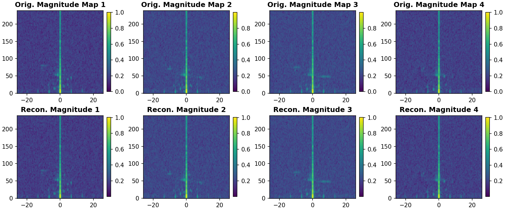
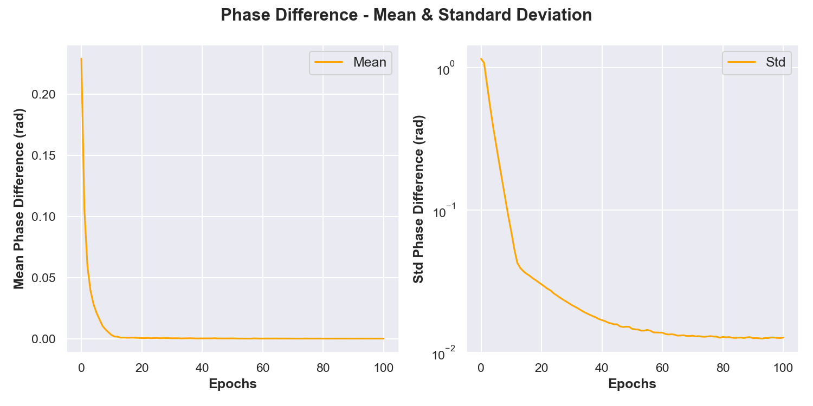
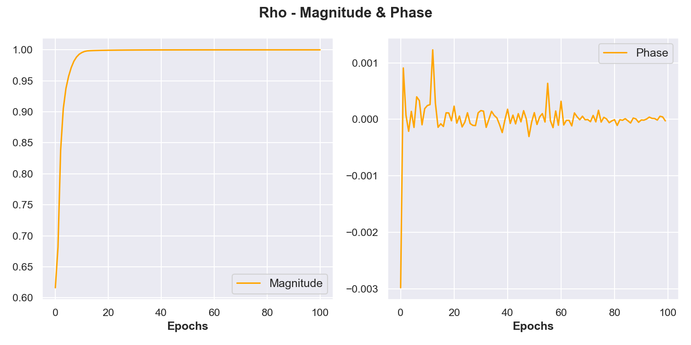
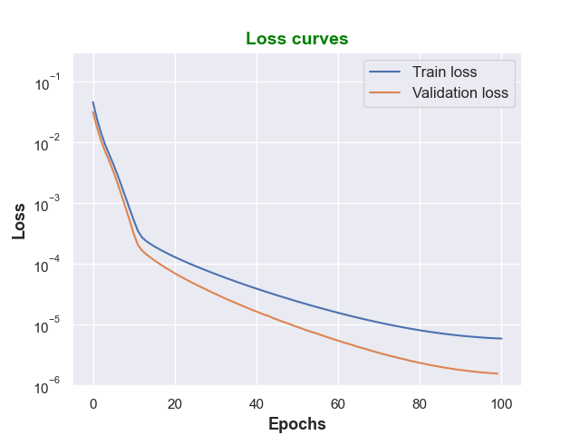

## Results Visualization

The model produces high-quality reconstructions of Range-Doppler maps during validation:

### Magnitude Maps:
- Original vs. Reconstructed magnitude information
- Demonstrates the model's ability to preserve amplitude characteristic

### Phase Evaluation:

**Phase Difference Statistics**:
- Phase difference standard deviation ≈ 0.02 radians ≈ 1.15°, showing very small and uniform phase errors
- Low std dev means the model consistently reconstructs phase across the entire image
- This demonstrates the model's ability to maintain phase coherence, critical for signal reconstruction

**Complex Correlation Coefficient (ρ)**:

The complex correlation coefficient measures how well the reconstructed signal matches the original signal by comparing both magnitude and phase information simultaneously.

**Mathematical Formula**:
$$\rho = \frac{\sum_{i,j} X_{i,j} \overline{Y_{i,j}}}{\sqrt{\sum_{i,j} |X_{i,j}|^2 \cdot \sum_{i,j} |Y_{i,j}|^2}}$$

Where:
- $X_{i,j}$ = original complex-valued Range-Doppler map matrix (H × W)
- $Y_{i,j}$ = reconstructed complex-valued Range-Doppler map matrix (H × W)
- $\overline{Y_{i,j}}$ = complex conjugate of the reconstructed image matrix
- $|X_{i,j}|$ = element-wise magnitude of the original image
- $|Y_{i,j}|$ = element-wise magnitude of the reconstructed image
- Sum is computed over all spatial pixels (i, j)

**Interpretation**:
- $|\rho| = 1$: Perfect reconstruction of both magnitude and phase (ideal case)
- $|\rho| = 0$: Complete mismatch between original and reconstruction
- $\arg(\rho) = 0$: Minimal phase difference between original and reconstructed images
- $\arg(\rho) \neq 0$: Phase offset between original and reconstruction
- $|\rho| > 0.9$ with $\arg(\rho) \approx 0$: Excellent reconstruction quality with good phase and magnitude preservation

<!-- ###  Loss Curves
- Training and validation loss progression
- Demonstrates convergence and generalization

 -->
